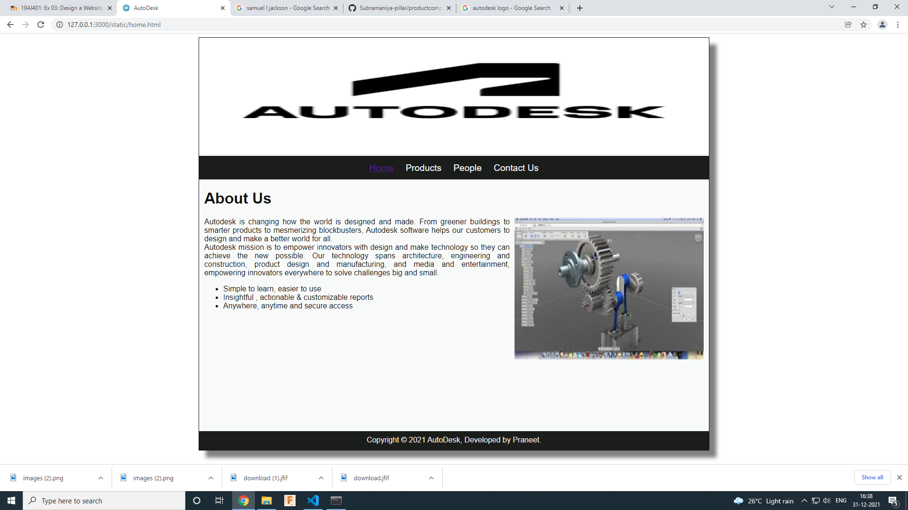
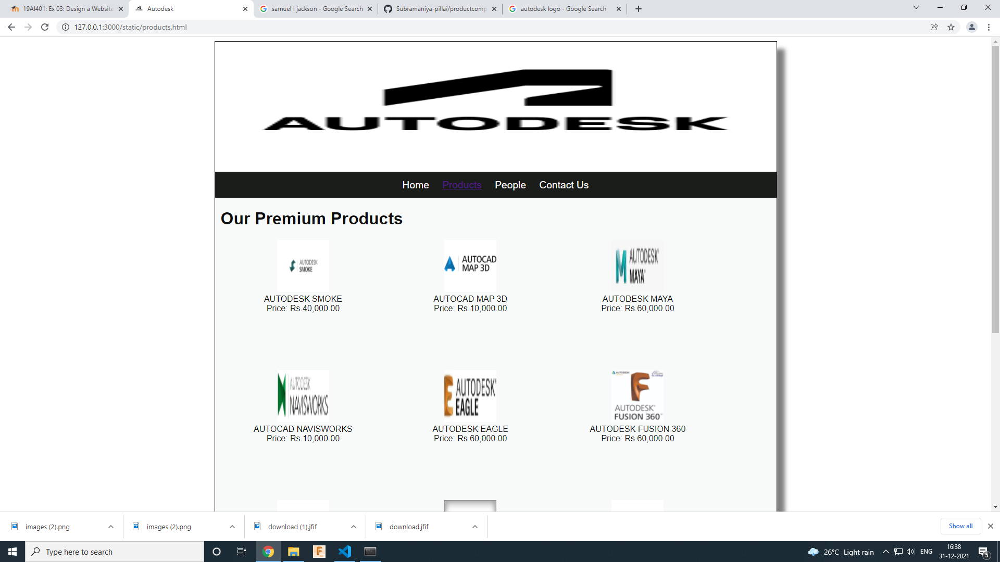
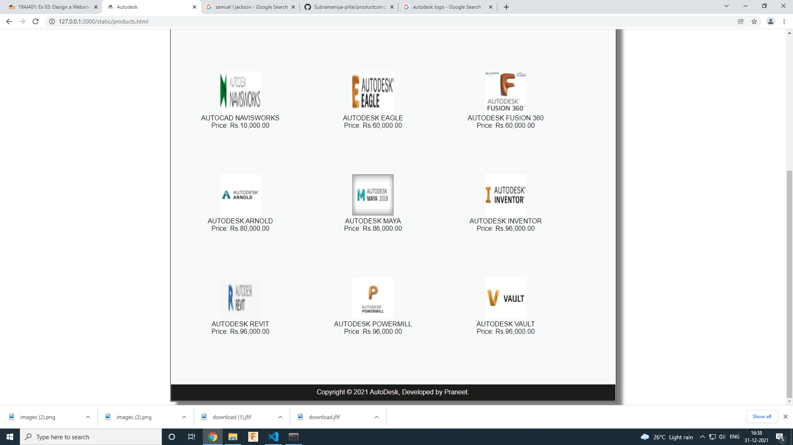
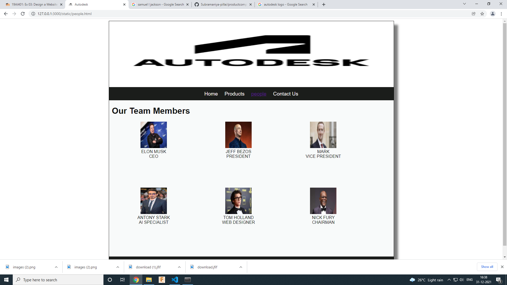
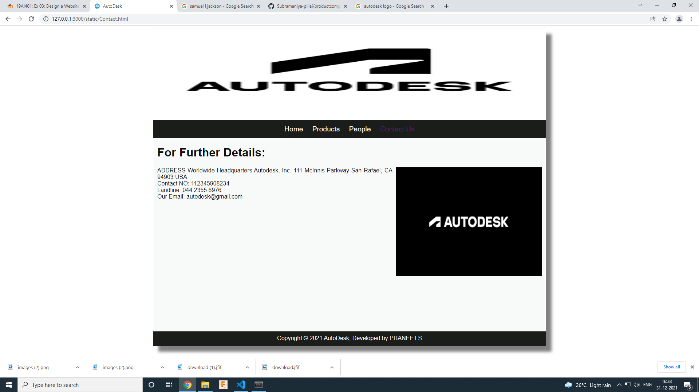

# Web Design for a Software Product Company

## AIM:

To design a static website for a software product company company.

## DESIGN STEPS:

### Step 1:

Requirement collection.

### Step 2:

Creating the layout using HTML and CSS.

### Step 3:

Updating the sample content.

### Step 4:

Choose the appropriate style and color scheme.

### Step 5:

Validate the layout in various browsers.

### Step 6:

Validate the HTML code.

### Step 6:

Publish the website in the given URL.

## PROGRAM :
### Home Page:
~~~
<!DOCTYPE html>
<html lang="en">
  <head>
    <title>AutoDesk</title>
    <link rel="stylesheet" href="./css/layout.css" />
    <link rel="icon" href="./img/icon.png" type="image/x-icon" />
  </head>

  <body>
    

      

      

        
<a href="/static/home.html">Home</a>

        
<a href="/static/products.html">Products</a>

        
<a href="/static/people.html">People</a>

        
<a href="/static/Contact.html">Contact Us</a>

      

      

        

          <h1>About Us</h1>
          
          

            Autodesk is changing how the world is designed and made.
From greener buildings to smarter products to mesmerizing blockbusters, Autodesk software helps our customers to design and make a better world for all.
             
            Autodesk mission is to empower innovators with design and make technology so they can achieve the new possible.
Our technology spans architecture, engineering and construction, product design and manufacturing, and media and entertainment, empowering innovators everywhere to solve challenges big and small.
            <ul>
              <li>Simple to learn, easier to use</li>
              <li>Insightful , actionable & customizable reports</li>
              <li>Anywhere, anytime and secure access</li>
            </ul>
          

        

      

      

        Copyright &#169; 2021 AutoDesk, Developed by Praneet.
      

    

  </body>
</html>
~~~
### Product Page:
~~~
<!DOCTYPE html>
<html lang="en">
  <head>
    <title>Autodesk</title>
    <link rel="stylesheet" href="./css/layout.css" />
    <link rel="icon" href="./img/images.png" type="image/x-icon" />
  </head>

  <body>
    

      

      

        
<a href="/static/home.html">Home</a>

        

          <a href="/static/products.html">Products</a>
        

        
<a href="/static/people.html">People</a>

        
<a href="/static/Contact.html">Contact Us</a>

      

      

        
    
          <h1>Our Premium Products</h1>
          

              
 
                  

                  
                  

                  
AUTODESK SMOKE

                  
Price: Rs.40,000.00 

              

              
 
                  

                  
                  

                  
AUTOCAD MAP 3D

                  
Price: Rs.10,000.00 

              

              
 
                

                
                

                
AUTODESK MAYA

                
Price: Rs.60,000.00 

            

            
 
              

              
              

              
AUTOCAD NAVISWORKS

              
Price: Rs.10,000.00 

          

          
 
            

            
            

            
AUTODESK EAGLE

            
Price: Rs.60,000.00 

          

          
 
            

            
            

            
AUTODESK FUSION 360

            
Price: Rs.60,000.00 

          

          
 
            

            
            

            
AUTODESK ARNOLD

            
Price: Rs.80,000.00 

          
         
        
 
          

          
          

          
AUTODESK MAYA

          
Price: Rs.86,000.00 

        
         
        
 
          

          
          

          
AUTODESK INVENTOR

          
Price: Rs.96,000.00 
 
        
 
          
 
            

            
            

            
AUTODESK REVIT

            
Price: Rs.96,000.00 

          
    
            
 
              

              
              

              
AUTODESK POWERMILL

              
Price: Rs.96,000.00 

            
   
              

                

                
              

              
AUTODESK VAULT

              
Price: Rs.96,000.00 

                

              

      

      

        Copyright &#169; 2021 AutoDesk, Developed by Praneet.
      

    

  </body>
</html>
~~~
### People Page:
~~~
<!DOCTYPE html>
<html lang="en">
  <head>
    <title>Autodesk</title>
    <link rel="stylesheet" href="./css/layout.css" />
    <link rel="icon" href="./img/images.png" type="image/x-icon" />
  </head>

  <body>
    

      

      

        
<a href="/static/home.html">Home</a>

        

          <a href="/static/products.html">Products</a>
        

        
<a href="/static/people.html">people</a>

        
<a href="/static/Contact.html">Contact Us</a>

      

      

        
    
          <h1>Our Team Members</h1>
          

              
 
                  

                  
                  

                  
ELON MUSK

                  
CEO 

              

              
 
                  

                  
                  

                  
JEFF BEZOS

                  
PRESIDENT 

              

              
 
                

                
                

                
MARK

                
VICE PRESIDENT 

            

            
 
              

              
              

              
ANTONY STARK

              
AI SPECIALIST 

          

          
 
            

            
            

            
TOM HOLLAND

            
WEB DESIGNER 

          

          
 
            

            
            

            
NICK FURY

            
CHAIRMAN 

          

          
                

              

      

      

        Copyright &#169; 2021 AutoDesk, Developed by Praneet.
      

    

  </body>
</html>
~~~
### Contact Page:
~~~
<!DOCTYPE html>
<html lang="en">
  <head>
    <title>AutoDesk</title>
    <link rel="stylesheet" href="./css/layout.css" />
    <link rel="icon" href="./img/icon.png" type="image/x-icon" />
  </head>
<body>
    

      

      

        
<a href="/static/home.html">Home</a>

        
<a href="/static/products.html">Products</a>

        
<a href="/static/people.html">People</a>

        
<a href="/static/Contact.html">Contact Us</a>

      

      

        

          <h1>For Further Details:</h1>
          
          

            ADDRESS
            Worldwide Headquarters
            Autodesk, Inc.
            111 McInnis Parkway
            San Rafael, CA 94903
            USA

             
            Contact NO: 112345908234
             
            Landline: 044 2355 8976
             
            Our Email: autodesk@gmail.com
        

    

  

  

    Copyright &#169; 2021 AutoDesk, Developed by PRANEET.S
  

</body>
</html>
~~~

## OUTPUT:

### Home Page:

### Product Page:

### People Page:

### Contact Page:

## Result:

Thus a website is designed for the software product company and the HTML,CSS code are validated.
